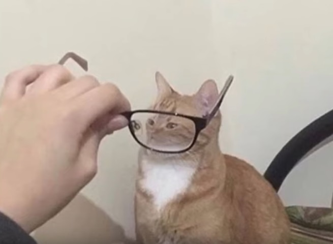
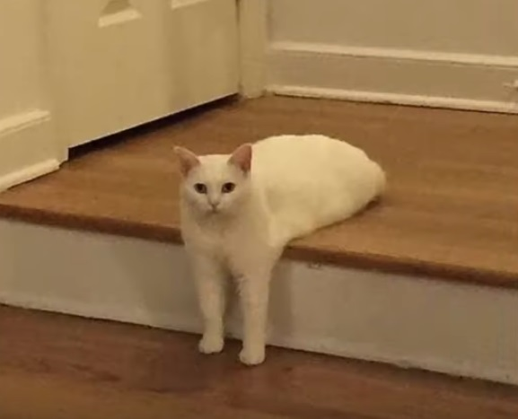
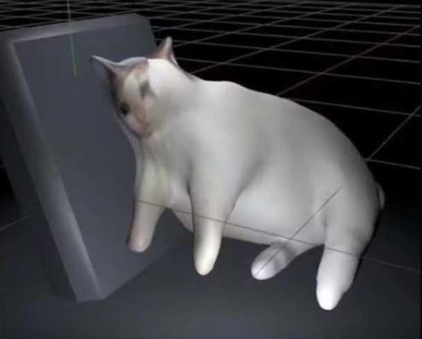

# Readme

### Introduccion.
Mi nombre es *James Allan Weisnner*, tengo 21 años y Soy estudiante del programa de ingeniería de sistemas en la **Escuela Colombiana de Ingeniería Julio Garavito** curso el plan de estudios 14 y trabajo en una compañía de BPO. Con el dinero que gano trato de restaurar un carro antiguo.

### Codigos

Este es el Merge Sort, era mi código favorito para parciales teóricos de PIMO.

 
	def mergeSort(arr): 
	    if len(arr) >1: 
	        mid = len(arr)//2 #Finding the mid of the array 
	        L = arr[:mid] # Dividing the array elements  
	        R = arr[mid:] # into 2 halves 
	  
	        mergeSort(L) # Sorting the first half 
	        mergeSort(R) # Sorting the second half 
	  
	        i = j = k = 0
	          
	        # Copy data to temp arrays L[] and R[] 
	        while i < len(L) and j < len(R): 
	            if L[i] < R[j]: 
	                arr[k] = L[i] 
	                i+=1
	            else: 
	                arr[k] = R[j] 
	                j+=1
	            k+=1
	          
	        # Checking if any element was left 
	        while i < len(L): 
	            arr[k] = L[i] 
	            i+=1
	            k+=1
	          
	        while j < len(R): 
	            arr[k] = R[j] 
	            j+=1
	            k+=1
	  
	def printList(arr): 
	    for i in range(len(arr)):         
	        print(arr[i],end=" ") 
	    print() 
	   
	if __name__ == '__main__': 
	    arr = [12, 11, 13, 5, 6, 7]  
	    print ("Given array is", end="\n")  
	    printList(arr) 
	    mergeSort(arr) 
	    print("Sorted array is: ", end="\n") 
	    printList(arr) 

Y esta es la solución a un problema de programación dinámica, por este tema de programación perdí la asignatura PIMO una vez y es mi tema menos preferido de la programación. 

	def count(S, m, n ): 
	  
	    if (n == 0): 
	        return 1
	  
	     
	    
	    if (n < 0): 
	        return 0; 
	  
	    if (m <=0 and n >= 1): 
	        return 0
	  
	  
	 
	    return count( S, m - 1, n ) + count( S, m, n-S[m-1] ); 
	  
	 
	arr = [1, 2, 3] 
	m = len(arr) 
	print(count(arr, m, 4)) 

Códigos  tomados de [acá ](https://www.geeksforgeeks.org/merge-sort/) y de [acá ](https://www.geeksforgeeks.org/coin-change-dp-7/).

###  Top 6 mejores imagenes de gatos de todos los tiempos.

No vas a creer el numero 5!

1.   
2.  
3.  
4.  
5.  
6.  

**Finalmente unas menciones honorificas.**

* 
* 
* 

## FIN

> Why are the trees speaking in vietnamese?!
>   
> Soldado estadounidense 1960.

## Laboratorio

